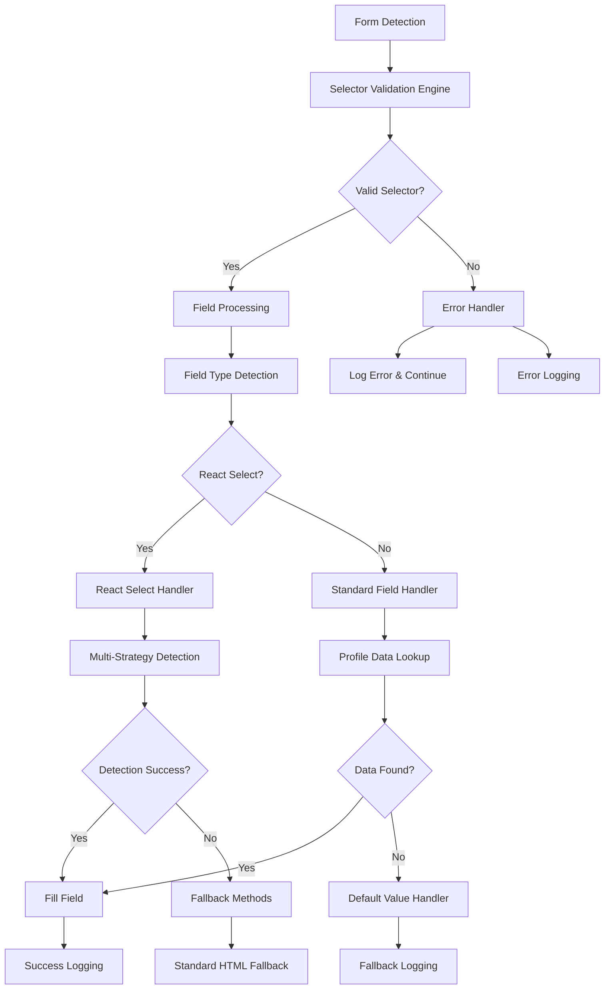

# Design Document

## Overview

This design addresses critical robustness issues in the autofill system by implementing comprehensive error handling, selector validation, enhanced React Select detection, and improved field mapping accuracy. The solution focuses on graceful degradation and detailed debugging capabilities to ensure reliable form filling across diverse job application sites.

## Architecture

### Core Components

1. **Selector Validation Engine** - Validates CSS selectors before use
2. **Enhanced Error Handler** - Centralized error handling with detailed logging
3. **React Select Detection System** - Multi-strategy component detection and interaction
4. **Field Mapping Validator** - Ensures accurate profile data mapping
5. **Debugging and Monitoring System** - Comprehensive logging and error reporting

### Component Interactions



## Components and Interfaces

### 1. Selector Validation Engine

```typescript
interface SelectorValidator {
  validateSelector(selector: string): ValidationResult;
  sanitizeSelector(selector: string): string;
  isValidCSSSelector(selector: string): boolean;
}

interface ValidationResult {
  isValid: boolean;
  sanitizedSelector?: string;
  error?: string;
  suggestion?: string;
}
```

**Key Features:**
- Validates CSS selectors before querySelector calls
- Handles numeric ID prefixes (e.g., `#627` → `[id="627"]`)
- Provides sanitized alternatives for invalid selectors
- Logs validation failures with suggestions

### 2. Enhanced Error Handler

```typescript
interface ErrorHandler {
  handleSelectorError(selector: string, error: Error): void;
  handleFieldError(field: DetectedField, error: Error): void;
  handleReactSelectError(element: HTMLElement, error: Error): void;
  getErrorSummary(): ErrorSummary;
}

interface ErrorSummary {
  totalErrors: number;
  selectorErrors: number;
  fieldErrors: number;
  reactSelectErrors: number;
  commonPatterns: string[];
}
```

**Key Features:**
- Centralized error handling for all autofill operations
- Detailed error context and stack traces
- Error pattern analysis for debugging
- Non-blocking error handling (continues processing)

### 3. React Select Detection System

```typescript
interface ReactSelectDetector {
  detectReactSelect(element: HTMLElement): ReactSelectInfo | null;
  getDetectionStrategies(): DetectionStrategy[];
  validateDetection(info: ReactSelectInfo): boolean;
}

interface ReactSelectInfo {
  container: HTMLElement;
  input: HTMLInputElement | null;
  control: HTMLElement | null;
  detectionMethod: string;
  confidence: number;
}

interface DetectionStrategy {
  name: string;
  detect(element: HTMLElement): ReactSelectInfo | null;
  priority: number;
}
```

**Detection Strategies (in priority order):**
1. **Class-based detection** - Look for react-select specific classes
2. **Role-based detection** - Find elements with combobox role
3. **Structure-based detection** - Analyze DOM structure patterns
4. **Attribute-based detection** - Check for React Select data attributes
5. **Behavioral detection** - Test for React Select-like behavior

### 4. Field Mapping Validator

```typescript
interface FieldMappingValidator {
  validateMapping(field: DetectedField): MappingResult;
  suggestAlternativeMapping(field: DetectedField): string[];
  getDefaultValue(field: DetectedField): string;
}

interface MappingResult {
  isValid: boolean;
  profilePath: string;
  confidence: number;
  alternatives: string[];
  defaultValue?: string;
}
```

**Key Features:**
- Validates profile data paths exist
- Provides intelligent alternative mappings
- Context-aware default value generation
- Confidence scoring for mapping accuracy

## Data Models

### Enhanced Field Detection

```typescript
interface EnhancedDetectedField extends DetectedField {
  validationResult: ValidationResult;
  mappingResult: MappingResult;
  errorHistory: FieldError[];
  fillAttempts: FillAttempt[];
}

interface FillAttempt {
  timestamp: number;
  method: string;
  success: boolean;
  error?: string;
  value?: string;
}
```

### Error Tracking

```typescript
interface FieldError {
  timestamp: number;
  type: 'selector' | 'mapping' | 'interaction' | 'validation';
  message: string;
  context: Record<string, any>;
  stackTrace?: string;
}
```

## Error Handling

### Selector Error Recovery

1. **Invalid Selector Detection**
   - Catch `DOMException` from querySelector calls
   - Log the invalid selector and context
   - Attempt selector sanitization
   - Fall back to alternative selection methods

2. **Selector Sanitization Process**
   ```typescript
   // Example: #627 → [id="627"]
   if (/^\d/.test(id)) {
     return `[id="${id}"]`;
   }
   
   // Example: Invalid characters → escaped version
   return selector.replace(/[^\w-#.[\]="':]/g, '\\$&');
   ```

### React Select Error Recovery

1. **Detection Failure Recovery**
   - Try multiple detection strategies
   - Log detection attempts and failures
   - Fall back to standard HTML input handling
   - Provide detailed component structure logging

2. **Interaction Failure Recovery**
   ```typescript
   async fillReactSelect(element: HTMLElement, value: string): Promise<boolean> {
     const strategies = [
       () => this.fillByDirectInput(element, value),
       () => this.fillByOptionClick(element, value),
       () => this.fillByKeyboardInput(element, value),
       () => this.fillByStandardFallback(element, value)
     ];
     
     for (const strategy of strategies) {
       try {
         if (await strategy()) return true;
       } catch (error) {
         this.errorHandler.logStrategyFailure(strategy.name, error);
       }
     }
     return false;
   }
   ```

### Field Mapping Error Recovery

1. **Missing Profile Data**
   - Check for alternative profile paths
   - Generate context-appropriate default values
   - Log missing data for profile improvement
   - Continue with reasonable defaults

2. **Incorrect Mapping Detection**
   - Validate mapping makes sense for field context
   - Suggest alternative mappings based on field labels
   - Use confidence scoring to select best mapping

## Testing Strategy

### Unit Tests

1. **Selector Validation Tests**
   ```typescript
   describe('SelectorValidator', () => {
     it('should handle numeric ID selectors', () => {
       expect(validator.validateSelector('#627')).toEqual({
         isValid: false,
         sanitizedSelector: '[id="627"]',
         error: 'ID selector cannot start with number'
       });
     });
   });
   ```

2. **React Select Detection Tests**
   ```typescript
   describe('ReactSelectDetector', () => {
     it('should detect react-select by class names', () => {
       const element = createMockReactSelect();
       const result = detector.detectReactSelect(element);
       expect(result.detectionMethod).toBe('class-based');
       expect(result.confidence).toBeGreaterThan(0.8);
     });
   });
   ```

### Integration Tests

1. **End-to-End Form Filling**
   - Test with various job application sites
   - Verify error recovery mechanisms
   - Validate logging and debugging output

2. **Error Scenario Testing**
   - Inject invalid selectors
   - Test with broken React Select components
   - Verify graceful degradation

### Performance Tests

1. **Selector Validation Performance**
   - Measure validation overhead
   - Test with large numbers of fields
   - Optimize validation algorithms

2. **Error Handling Performance**
   - Ensure error handling doesn't block processing
   - Test error logging performance
   - Validate memory usage with extensive error logs

## Implementation Phases

### Phase 1: Selector Validation and Safety
- Implement SelectorValidator class
- Add validation to all querySelector calls
- Update generateReactSelectSelector method
- Add comprehensive error logging

### Phase 2: Enhanced React Select Detection
- Implement multi-strategy detection system
- Add fallback interaction methods
- Improve component structure analysis
- Add detailed debugging output

### Phase 3: Field Mapping Improvements
- Add missing profile data fields
- Implement mapping validation
- Add alternative mapping suggestions
- Improve default value generation

### Phase 4: Error Handling and Recovery
- Implement centralized error handler
- Add error pattern analysis
- Implement graceful degradation
- Add performance monitoring

### Phase 5: Debugging and Monitoring
- Add comprehensive logging system
- Implement error reporting dashboard
- Add success rate monitoring
- Create debugging utilities

## Security Considerations

1. **Selector Injection Prevention**
   - Validate all user-provided selectors
   - Sanitize dynamic selector generation
   - Prevent CSS injection attacks

2. **Error Information Disclosure**
   - Sanitize error messages for production
   - Avoid exposing sensitive DOM structure
   - Implement secure logging practices

3. **Performance Security**
   - Prevent selector-based DoS attacks
   - Limit error log size and retention
   - Implement rate limiting for error generation

## Monitoring and Metrics

1. **Success Rate Metrics**
   - Field filling success rate by type
   - React Select interaction success rate
   - Error recovery success rate

2. **Error Pattern Analysis**
   - Most common selector errors
   - React Select detection failure patterns
   - Field mapping accuracy metrics

3. **Performance Metrics**
   - Selector validation time
   - Error handling overhead
   - Memory usage for error tracking