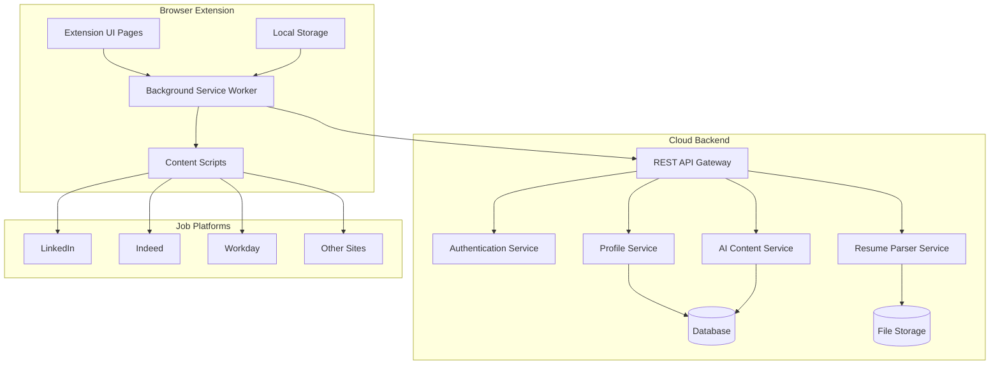

# Design Document

## Overview

The Job Application Autofill Chrome Extension is architected as a comprehensive browser extension that combines client-side form detection and manipulation with cloud-based data storage and AI services. The system follows a modular design pattern that separates concerns between user interface, content script injection, background processing, and cloud services.

The extension leverages the existing Chrome extension boilerplate structure while adding specialized components for job application automation. The architecture prioritizes security, performance, and user experience while maintaining compatibility with major job platforms.

## Architecture

### High-Level Architecture



### Extension Architecture Components

1. **Extension UI Layer**: Popup, options page, and side panel for user interaction
2. **Background Service Worker**: Coordinates between UI and content scripts, manages API calls
3. **Content Scripts**: Injected into job platform pages for form detection and manipulation
4. **Storage Layer**: Local storage for caching and offline functionality
5. **Cloud Integration**: RESTful API communication with backend services

### Data Flow

1. User configures profile through extension UI
2. Profile data syncs to cloud backend via background service worker
3. Content scripts detect job application forms on supported platforms
4. Background worker retrieves user profile and AI-generated content
5. Content scripts populate forms with retrieved data
6. User reviews and submits applications

## Components and Interfaces

### Extension Components

#### 1. Profile Management UI (`pages/options/src/ProfileManager.tsx`)
- **Purpose**: User interface for managing personal and professional information
- **Key Features**:
  - Profile form with validation
  - Resume upload and parsing
  - Default answers configuration
  - Cloud sync status display

#### 2. Autofill Control UI (`pages/popup/src/AutofillControl.tsx`)
- **Purpose**: Quick access popup for autofill controls
- **Key Features**:
  - Current page detection status
  - One-click autofill trigger
  - Recent activity summary
  - Settings quick access

#### 3. Background Service Worker (`chrome-extension/src/background/autofill-coordinator.ts`)
- **Purpose**: Orchestrates communication between UI, content scripts, and cloud services
- **Key Responsibilities**:
  - API communication management
  - Profile data caching
  - Content script message handling
  - Authentication state management

#### 4. Content Script System

##### Form Detection Engine (`pages/content/src/form-detector.ts`)
- **Purpose**: Identifies and analyzes job application forms
- **Key Features**:
  - Platform-specific form selectors
  - Field type classification
  - Form validation state tracking
  - Dynamic form change detection

##### Autofill Engine (`pages/content/src/autofill-engine.ts`)
- **Purpose**: Populates form fields with user data
- **Key Features**:
  - Field mapping and data insertion
  - File upload handling
  - Dropdown and checkbox management
  - Error handling and rollback

##### AI Content Integration (`pages/content/src/ai-content-handler.ts`)
- **Purpose**: Handles AI-generated content insertion
- **Key Features**:
  - Context extraction from job postings
  - AI content request management
  - Content preview and editing interface
  - User approval workflow

#### 5. Storage Management (`packages/storage/lib/impl/profile-storage.ts`)
- **Purpose**: Local data persistence and caching
- **Key Features**:
  - Profile data caching
  - Offline functionality support
  - Data synchronization tracking
  - Secure local storage encryption

### Cloud Backend Components

#### 1. Authentication Service
- **Technology**: JWT-based authentication
- **Features**: User registration, login, token refresh, account management

#### 2. Profile Service
- **Technology**: RESTful API with data validation
- **Features**: CRUD operations for user profiles, data encryption, multi-device sync

#### 3. Resume Parser Service
- **Technology**: Python-based parsing with ML libraries
- **Features**: PDF/DOCX parsing, structured data extraction, confidence scoring

#### 4. AI Content Service
- **Technology**: Integration with OpenAI/Claude APIs
- **Features**: Context-aware content generation, job description analysis, personalization

### Platform Integration Modules

#### LinkedIn Integration (`pages/content/src/platforms/linkedin.ts`)
- **Selectors**: Easy Apply forms, profile import fields
- **Special Handling**: Dynamic form loading, multi-step applications
- **File Upload**: Resume attachment automation

#### Indeed Integration (`pages/content/src/platforms/indeed.ts`)
- **Selectors**: Application forms, quick apply buttons
- **Special Handling**: Employer-specific form variations
- **File Upload**: Cover letter and resume handling

#### Workday Integration (`pages/content/src/platforms/workday.ts`)
- **Selectors**: Career portal forms, multi-page applications
- **Special Handling**: Complex form workflows, conditional fields
- **File Upload**: Multiple document types support

## Data Models

### User Profile Model
```typescript
interface UserProfile {
  id: string;
  personalInfo: {
    firstName: string;
    lastName: string;
    email: string;
    phone: string;
    address: Address;
  };
  professionalInfo: {
    workExperience: WorkExperience[];
    education: Education[];
    skills: string[];
    certifications: Certification[];
  };
  preferences: {
    defaultAnswers: Record<string, string>;
    jobPreferences: JobPreferences;
    privacySettings: PrivacySettings;
  };
  documents: {
    resumes: ResumeDocument[];
    coverLetters: CoverLetterTemplate[];
  };
  metadata: {
    createdAt: Date;
    updatedAt: Date;
    lastSyncAt: Date;
  };
}
```

### Form Detection Model
```typescript
interface DetectedForm {
  platform: 'linkedin' | 'indeed' | 'workday' | 'custom';
  formId: string;
  fields: FormField[];
  jobContext?: JobContext;
  confidence: number;
  supportedFeatures: AutofillFeature[];
}

interface FormField {
  id: string;
  type: FieldType;
  label: string;
  selector: string;
  required: boolean;
  mappedProfileField?: string;
  aiContentType?: AIContentType;
}
```

### AI Content Model
```typescript
interface AIContentRequest {
  type: 'cover_letter' | 'question_response' | 'summary';
  context: {
    jobDescription: string;
    companyInfo: string;
    userProfile: UserProfile;
    specificQuestion?: string;
  };
  preferences: {
    tone: 'professional' | 'casual' | 'enthusiastic';
    length: 'short' | 'medium' | 'long';
    focus: string[];
  };
}

interface AIContentResponse {
  content: string;
  confidence: number;
  suggestions: string[];
  metadata: {
    generatedAt: Date;
    model: string;
    tokens: number;
  };
}
```

## Error Handling

### Client-Side Error Handling

1. **Form Detection Failures**
   - Graceful degradation when selectors fail
   - Fallback to manual field identification
   - User notification with manual override options

2. **Autofill Errors**
   - Field-level error tracking
   - Partial success handling
   - Rollback capabilities for failed operations

3. **Network Connectivity Issues**
   - Offline mode with cached data
   - Retry mechanisms with exponential backoff
   - User feedback for connectivity status

4. **Authentication Failures**
   - Automatic token refresh
   - Secure re-authentication flow
   - Data protection during auth failures

### Cloud Service Error Handling

1. **API Rate Limiting**
   - Request queuing and throttling
   - Priority-based request handling
   - User notification for service limits

2. **AI Service Failures**
   - Fallback to cached responses
   - Alternative content generation methods
   - Clear user communication about AI availability

3. **Data Synchronization Errors**
   - Conflict resolution strategies
   - Data integrity validation
   - Manual sync override options

## Testing Strategy

### Unit Testing
- **Framework**: Jest with TypeScript support
- **Coverage**: All utility functions, data models, and business logic
- **Mocking**: External APIs, browser APIs, and DOM interactions

### Integration Testing
- **Framework**: Playwright for browser automation
- **Scope**: Extension installation, UI interactions, content script injection
- **Platforms**: Chrome, Firefox, Edge compatibility testing

### End-to-End Testing
- **Framework**: WebDriver with platform-specific test sites
- **Scenarios**: Complete autofill workflows on major job platforms
- **Data**: Anonymized test profiles and job postings

### Security Testing
- **Areas**: Data encryption, authentication flows, XSS prevention
- **Tools**: OWASP ZAP, manual penetration testing
- **Compliance**: GDPR, CCPA data protection requirements

### Performance Testing
- **Metrics**: Extension load time, form detection speed, autofill performance
- **Tools**: Chrome DevTools, Lighthouse, custom performance monitoring
- **Benchmarks**: Sub-second form detection, <100ms autofill completion

### Platform Compatibility Testing
- **Browsers**: Chrome, Firefox, Edge, Safari (future)
- **Platforms**: Windows, macOS, Linux
- **Job Sites**: LinkedIn, Indeed, Workday, custom employer sites

### User Acceptance Testing
- **Method**: Beta testing with real job seekers
- **Metrics**: Success rate, user satisfaction, time savings
- **Feedback**: Iterative improvement based on user experience

## Security Considerations

### Data Protection
- **Encryption**: AES-256 for data at rest, TLS 1.3 for data in transit
- **Key Management**: Secure key derivation and rotation
- **Data Minimization**: Only collect necessary information

### Authentication & Authorization
- **Multi-Factor Authentication**: Optional 2FA for enhanced security
- **Session Management**: Secure token handling with automatic expiration
- **Access Control**: Role-based permissions for different user types

### Privacy Compliance
- **GDPR Compliance**: Right to deletion, data portability, consent management
- **Data Anonymization**: Remove PII from analytics and logging
- **Consent Management**: Clear opt-in/opt-out mechanisms

### Extension Security
- **Content Security Policy**: Strict CSP to prevent XSS attacks
- **Permissions**: Minimal required permissions with clear justification
- **Code Integrity**: Signed releases and integrity verification