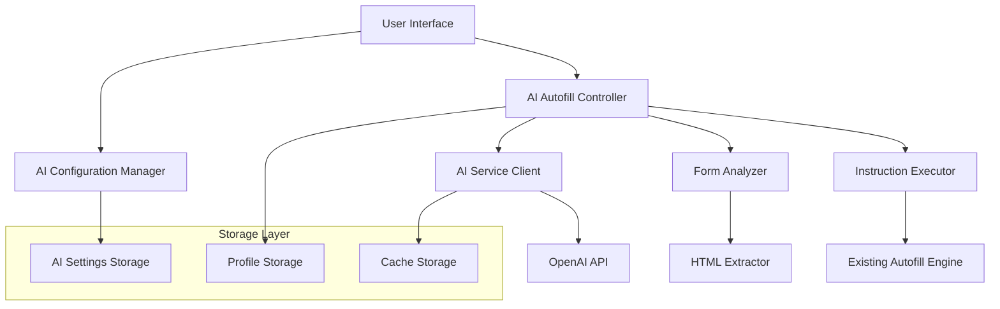

# Design Document

## Overview

The Smart AI Autofill feature integrates OpenAI's language models to provide intelligent form analysis and automated filling for job applications. The system leverages LLM capabilities to understand complex form structures and generate precise filling instructions, while maintaining the existing extension architecture as the execution layer.

The design builds upon the current autofill infrastructure (`EnhancedAutofill`, `OnDemandAutofill`) and extends the options/popup interfaces to support AI configuration and controls.

## Architecture

### High-Level Architecture



### Component Integration

The AI autofill system integrates with existing components:

- **Options Page**: Extended with AI configuration section
- **Popup**: Enhanced with AI Mode toggle and AI Autofill button
- **Content Script**: New AI autofill handler alongside existing `EnhancedAutofill`
- **Background Script**: Enhanced message routing for AI operations
- **Storage**: New AI-specific storage for tokens and cache

## Components and Interfaces

### 1. AI Configuration Manager

**Location**: `pages/options/src/components/AIConfigurationManager.tsx`

**Purpose**: Manages OpenAI API token configuration and AI Mode settings

**Interface**:
```typescript
interface AIConfigurationManager {
  // Token management
  validateToken(token: string): Promise<boolean>;
  saveToken(token: string): Promise<void>;
  deleteToken(): Promise<void>;
  
  // Settings management
  toggleAIMode(enabled: boolean): Promise<void>;
  getAISettings(): Promise<AISettings>;
  updateAISettings(settings: Partial<AISettings>): Promise<void>;
}

interface AISettings {
  enabled: boolean;
  apiToken?: string;
  model: 'gpt-4' | 'gpt-3.5-turbo';
  maxTokens: number;
  temperature: number;
  cacheEnabled: boolean;
  autoTrigger: boolean;
}
```

### 2. AI Service Client

**Location**: `chrome-extension/src/background/ai/ai-service-client.ts`

**Purpose**: Handles communication with OpenAI API

**Interface**:
```typescript
interface AIServiceClient {
  // API communication
  analyzeForm(htmlContent: string, userProfile: UserProfile, jobContext?: JobContext): Promise<AIFormAnalysis>;
  validateToken(token: string): Promise<boolean>;
  
  // Cache management
  getCachedAnalysis(htmlHash: string): Promise<AIFormAnalysis | null>;
  setCachedAnalysis(htmlHash: string, analysis: AIFormAnalysis): Promise<void>;
}

interface AIFormAnalysis {
  instructions: FormInstruction[];
  confidence: number;
  reasoning: string;
  warnings: string[];
}

interface FormInstruction {
  action: 'fill' | 'select' | 'click' | 'upload';
  selector: string;
  value?: string;
  options?: string[];
  reasoning: string;
  confidence: number;
}
```

### 3. AI Autofill Controller

**Location**: `pages/content/src/ai-autofill-controller.ts`

**Purpose**: Orchestrates AI-powered autofill process

**Interface**:
```typescript
interface AIAutofillController {
  // Main autofill flow
  performAIAutofill(): Promise<AIAutofillResult>;
  
  // Form analysis
  extractFormHTML(): Promise<string>;
  analyzeWithAI(htmlContent: string): Promise<AIFormAnalysis>;
  
  // Instruction execution
  executeInstructions(instructions: FormInstruction[]): Promise<ExecutionResult[]>;
  
  // UI management
  showAIButton(): void;
  hideAIButton(): void;
  updateProgress(progress: AIAutofillProgress): void;
}

interface AIAutofillResult extends AutofillResult {
  aiAnalysis: AIFormAnalysis;
  executionResults: ExecutionResult[];
  totalInstructions: number;
  successfulInstructions: number;
}
```

### 4. HTML Form Extractor

**Location**: `pages/content/src/ai/html-extractor.ts`

**Purpose**: Extracts and sanitizes HTML for AI analysis

**Interface**:
```typescript
interface HTMLExtractor {
  extractFormHTML(container?: HTMLElement): Promise<ExtractedHTML>;
  sanitizeHTML(html: string): string;
  generateHTMLHash(html: string): string;
}

interface ExtractedHTML {
  html: string;
  hash: string;
  metadata: {
    url: string;
    timestamp: Date;
    formCount: number;
    fieldCount: number;
  };
}
```

### 5. Instruction Executor

**Location**: `pages/content/src/ai/instruction-executor.ts`

**Purpose**: Executes AI-generated form filling instructions

**Interface**:
```typescript
interface InstructionExecutor {
  executeInstruction(instruction: FormInstruction): Promise<ExecutionResult>;
  executeInstructions(instructions: FormInstruction[]): Promise<ExecutionResult[]>;
  
  // Specific action handlers
  fillTextInput(selector: string, value: string): Promise<ExecutionResult>;
  selectOption(selector: string, value: string): Promise<ExecutionResult>;
  clickElement(selector: string): Promise<ExecutionResult>;
  uploadFile(selector: string, fileData: FileData): Promise<ExecutionResult>;
}

interface ExecutionResult {
  instruction: FormInstruction;
  success: boolean;
  error?: string;
  actualValue?: string;
  executionTime: number;
}
```

## Data Models

### AI-Specific Storage Types

```typescript
// AI Settings Storage
interface AISettingsStorage extends BaseStorageType<AISettings> {}

// AI Cache Storage
interface AICacheStorage extends BaseStorageType<AICache> {}

interface AICache {
  analyses: Record<string, CachedAnalysis>;
  maxSize: number;
  ttl: number; // Time to live in milliseconds
}

interface CachedAnalysis {
  analysis: AIFormAnalysis;
  timestamp: Date;
  url: string;
  hits: number;
}

// Extended User Profile for AI Context
interface AIUserContext extends UserProfile {
  aiPreferences: {
    preferredTone: 'professional' | 'casual' | 'enthusiastic';
    customInstructions?: string;
    excludedFields: string[];
  };
}
```

### AI Prompt Templates

```typescript
interface AIPromptTemplate {
  system: string;
  user: string;
  examples: PromptExample[];
}

interface PromptExample {
  input: {
    html: string;
    profile: Partial<UserProfile>;
  };
  output: AIFormAnalysis;
}
```

## Error Handling

### Error Types

```typescript
type AIError = 
  | 'INVALID_TOKEN'
  | 'API_RATE_LIMIT'
  | 'API_QUOTA_EXCEEDED'
  | 'NETWORK_ERROR'
  | 'INVALID_RESPONSE'
  | 'PARSING_ERROR'
  | 'EXECUTION_FAILED';

interface AIErrorHandler {
  handleError(error: AIError, context: ErrorContext): Promise<ErrorResolution>;
  retryWithBackoff(operation: () => Promise<any>, maxRetries: number): Promise<any>;
}

interface ErrorResolution {
  action: 'retry' | 'fallback' | 'abort' | 'user_action_required';
  message: string;
  fallbackStrategy?: 'traditional_autofill' | 'manual_mode';
}
```

### Fallback Strategies

1. **API Failure**: Fall back to traditional autofill using existing `EnhancedAutofill`
2. **Token Issues**: Prompt user to update token, disable AI Mode temporarily
3. **Parsing Errors**: Use partial results, log for improvement
4. **Execution Failures**: Continue with remaining instructions, report issues

## Testing Strategy

### Unit Tests

1. **AI Service Client Tests**
   - Mock OpenAI API responses
   - Test token validation
   - Test error handling scenarios
   - Test caching mechanisms

2. **HTML Extractor Tests**
   - Test HTML sanitization
   - Test form detection accuracy
   - Test hash generation consistency

3. **Instruction Executor Tests**
   - Test each action type (fill, select, click, upload)
   - Test error recovery
   - Test element finding strategies

### Integration Tests

1. **End-to-End AI Autofill Flow**
   - Test complete flow from button click to form completion
   - Test with various form types and structures
   - Test error scenarios and fallbacks

2. **Configuration Management**
   - Test token saving/loading
   - Test settings persistence
   - Test AI Mode toggle functionality

### Performance Tests

1. **API Response Times**
   - Measure typical response times
   - Test with large HTML payloads
   - Test caching effectiveness

2. **Memory Usage**
   - Monitor memory usage during AI operations
   - Test cache size limits
   - Test cleanup procedures

### Security Tests

1. **Token Security**
   - Verify secure token storage
   - Test token encryption/decryption
   - Test token deletion completeness

2. **HTML Sanitization**
   - Test removal of sensitive data
   - Test script injection prevention
   - Test data minimization

## Implementation Phases

### Phase 1: Core Infrastructure
- AI Settings storage and management
- Basic OpenAI API client
- Token validation and storage
- Options page AI configuration section

### Phase 2: Form Analysis
- HTML extraction and sanitization
- AI prompt engineering and testing
- Response parsing and validation
- Caching implementation

### Phase 3: Instruction Execution
- Instruction executor implementation
- Integration with existing autofill engine
- Error handling and fallback strategies
- Progress tracking and user feedback

### Phase 4: UI Integration
- AI Mode toggle in popup
- AI Autofill button implementation
- Progress indicators and status updates
- Error messaging and user guidance

### Phase 5: Optimization and Polish
- Performance optimization
- Cache management improvements
- Enhanced error recovery
- User experience refinements

## Security Considerations

### API Token Security
- Store tokens encrypted in Chrome storage
- Never log or expose tokens in console
- Implement secure token deletion
- Use HTTPS for all API communications

### Data Privacy
- Minimize HTML content sent to AI
- Remove sensitive data before API calls
- Implement user consent for AI features
- Provide clear data usage disclosure

### Content Security
- Sanitize all HTML before processing
- Validate all AI responses before execution
- Implement instruction validation
- Prevent malicious instruction execution

## Performance Considerations

### API Optimization
- Implement intelligent caching
- Use request batching where possible
- Implement rate limiting and backoff
- Monitor API usage and costs

### Memory Management
- Limit cache size and implement LRU eviction
- Clean up large HTML extractions
- Monitor memory usage during operations
- Implement garbage collection triggers

### User Experience
- Show progress indicators for long operations
- Implement cancellation capabilities
- Provide immediate feedback for user actions
- Optimize for perceived performance